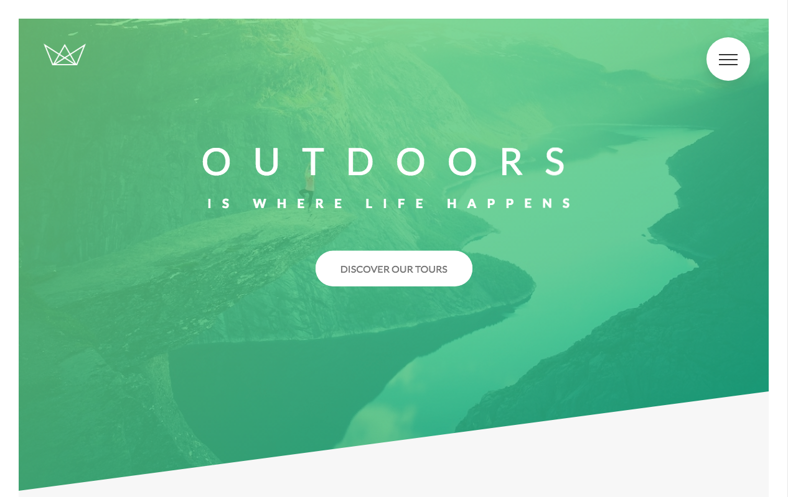

# [Natours Template](https://costaleonardo.github.io/html-css-natours-template/)

> Natours is a tourism agency template built from the [Advanced CSS and Sass: Flexbox, Grid, Animations and More!](https://www.udemy.com/advanced-css-and-sass/) course. This template was built with HTML5, Sass, and PostCSS.

## Preview

**[View Live Preview](https://costaleonardo.github.io/html-css-natours-template/)**

## Download and Installation

To begin using this template, choose one of the following options to get started:

* Clone the repo: `git clone https://github.com/costaleonardo/html-css-natours-template.git`
* [Fork, Clone, or Download on GitHub](https://github.com/costaleonardo/html-css-natours-template)

## Bugs and Issues

Have a bug or an issue with this template? [Open a new issue](https://github.com/costaleonardo/html-css-natours-template/issues) here on GitHub.

## Copyright and License

This project is licensed under the [MIT](https://opensource.org/licenses/MIT) License.
